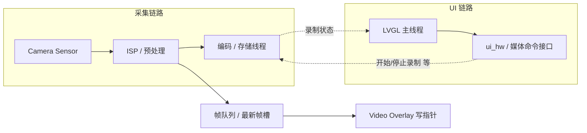

# 相机实时预览与 LVGL UI 分层架构（目标平台）

## 目录

- [相关文档](#相关文档)
- [1. 文档定位与适用范围](#1-文档定位与适用范围)
- [2. 推荐方案：硬件叠加层 / 独立显示层](#2-推荐方案硬件叠加层--独立显示层)
- [3. 优势](#3-优势)
- [4. 实现要点（与 LVGL 显示栈的关系）](#4-实现要点与-lvgl-显示栈的关系)
- [5. 录制与 UI 的职责划分](#5-录制与-ui-的职责划分)
- [6. 推荐软件架构与数据流](#6-推荐软件架构与数据流)
- [7. 关键注意事项](#7-关键注意事项)
- [8. 与本仓库的对应关系](#8-与本仓库的对应关系)

---

## 相关文档

| 文档 | 用途 |
|------|------|
| **`docs/README.md`** | 项目文档总索引与阅读顺序 |
| **`docs/project-plan.md`** | §2.3 与本文件对应；阶段 2/3 依赖关系 |
| **`docs/firmware-fw-v1-framework.md`** | 相机、回放等产品能力大纲 |
| **`docs/ui-fw-v1-mapping.md`** | 固件章节 ↔ 模拟器页面索引 |
| **`docs/ui-simulator-status.md`** | 当前模拟器落地路径（`ui_page_main` 等） |
| **`.cursor/rules/rules.md`** | §**1.0** `ui_hw_hal` 占位与主题约定 |

---

## 1. 文档定位与适用范围

本文描述 **目标嵌入式产品**（Linux DRM/KMS、Android SurfaceFlinger、带 DMA2D/多层 OSD 的 MCU/MPU 等）上，**相机实时预览** 与 **LVGL 绘制的 UI** 如何 **职责分离、并行合成**，以保证：

- 预览流畅、低 CPU 占用；
- UI 动画与控件刷新不阻塞采集与编码；
- 录像链路稳定。

**当前 PC 模拟器仓库**（`lv_port_pc_vscode`）**无真实 Sensor/编码器/多层显示**，主界面「预览区」为 **占位布局与手势**；落地目标机时，应按本文在 **BSP / 显示驱动 / 采集中间件** 侧实现，LVGL 侧保持 **薄 UI + 命令下发**（与 **`src/ui/platform/ui_hw_hal.c`** 等占位 HAL 的演进方向一致）。

---

## 2. 推荐方案：硬件叠加层 / 独立显示层

许多平台支持 **多个硬件图层（Overlay）** 或 **独立平面（Plane）**，由显示控制器在 **VSync** 下做 **Alpha 混合与缩放**，最终输出一帧到面板。

典型做法：

| 层级（示例） | 内容 | 说明 |
|-------------|------|------|
| 底层或独立 Video 层 | **YUV/RGB 相机预览帧** | 由 DMA/VIP/VE 等直接写显存或专用 buffer，**不经过 LVGL 的 draw 管线** |
| 顶层或 UI 层 | **LVGL 合成的 OSD** | `flush_cb` 仅更新 UI 图层；透明区域露出下层视频 |

也可在 **同一套 DRM/KMS** 下申请 **primary + overlay plane**，或在 **Android** 中 **SurfaceView/TextureView + LVGL 所在 Surface** 分层（具体 API 依平台而定）。

**与「双缓冲」的关系**：常见配置是 **LVGL 使用一套 draw buffer** 写 UI 层；**视频层** 使用 **另一套物理连续或平台要求的 buffer**。二者 **不必** 共用同一块 `lv_disp_draw_buf_t`；重点是 **合成阶段由硬件完成**，避免把每帧视频 **blit 进 LVGL canvas** 造成 CPU/带宽暴涨。

---

## 3. 优势

1. **零拷贝（理想情况）**  
   视频帧从 Sensor → ISP → 内存/显存 → **Overlay 可见**，不经 LVGL 全屏重绘，显著降低 **CPU** 与 **内存带宽**。

2. **帧率与刷新率解耦**  
   预览可按 **30/60 fps** 更新视频层；LVGL 仍按 **`LV_DEF_REFR_PERIOD`** 或事件驱动刷新 UI 层，**互不抢占**同一条软件渲染路径。

3. **撕裂控制**  
   由显示子系统 **VSync / page-flip** 保证合成时刻一致，减少撕裂（具体能力依赖驱动与模式）。

4. **职责清晰**  
   LVGL **不负责** 视频像素搬运；仅负责按钮、状态、参数面板等 **OSD**。

---

## 4. 实现要点（与 LVGL 显示栈的关系）

- **LVGL 显示驱动 `flush_cb`**：将 **UI 图层** 的脏区写到 **分配给 LVGL 的 buffer / plane**；**不要**在 `flush_cb` 里整帧 memcpy 视频。
- **视频通路**：在 **采集模块或显示服务** 中，将 **最新预览帧** 提交到 **Video Overlay** 的 buffer，并调用平台接口设置 **图层地址、格式、stride、裁剪、旋转** 等。
- **合成与顺序**：通过 **DRM plane z-order**、**硬件 mixer** 或 **厂商 OSD 寄存器** 设定 **视频在下、UI 在上**（或产品需要的顺序），必要时配置 **per-pixel alpha** 或 **color key**。
- **若平台仅单 buffer 无真 Overlay**：可退化为 **缩放后的预览纹理 + LVGL `lv_image`/Canvas** 方案，但需评估 **分辨率与帧率**（见第 7 节）；**优先**争取硬件层方案。

---

## 5. 录制与 UI 的职责划分

**录像（编码与写文件）应由采集/媒体子系统独立完成。** UI 只做两件事：

1. **控制面**  
   通过按钮、手势等触发 **开始/停止录制**（或切换分辨率/码率等 **意图**），以 **非阻塞** 方式把命令投递到 **采集线程或媒体服务**（消息队列、Binder、Unix socket 等，依平台而定）。

2. **状态面**  
   显示 **录制中**（红点、计时、码率占位等），数据来自 **采集模块回传的状态**（订阅/轮询/回调到 LVGL 线程时 **仅设标志或 `lv_async_call`**，避免在采集线程直接调用 LVGL API）。

**禁止**：在 LVGL 事件回调里执行 **长时间阻塞**（同步编码、大内存分配、文件 fsync 等），以免卡死 UI 与输入处理。

---

## 6. 推荐软件架构与数据流

采集与显示 **解耦**：采集线程产出帧，**一路给编码器（若正在录）**，**一路给显示（预览层或队列）**；LVGL 线程 **不**在采集回调里直接改控件树，仅通过 **线程安全队列 + LVGL 线程内刷新** 更新 OSD。

要点简述：

- **采集线程**：抓帧 → 若正在录制则送 **编码器**；同时更新 **预览用的 buffer 或队列**。
- **显示合成**：**硬件**将 **Overlay 中的视频** 与 **LVGL 输出的 UI 层** 合成到屏幕。
- **LVGL 线程**：处理触摸、动画、**录制按钮**；通过 **HAL/IPC** 发命令；收到状态后更新 **红点/计时** 等控件。

若采用 **队列 + LVGL `lv_image`** 的纯软件路径（无 Overlay），则 **LVGL 主线程**定期取 **最新帧描述符**（fd/物理地址/CPU 映射视平台而定），在 **锁内换 buffer 指针** 后 **`lv_obj_invalidate(img)`**，仍应避免在采集线程调用 LVGL。

---

## 7. 关键注意事项

| 主题 | 说明 |
|------|------|
| **内存与性能** | 高分辨率（如 1080p）全速 RGB 预览经 CPU 进 LVGL 代价高；优先 **Overlay** 或 **缩放 + YUV**。评估 **带宽、cache、总线**。 |
| **触摸与对焦** | 若预览区需 **点击对焦**，将 **触摸坐标** 映射到 **传感器/图像坐标**，通过 **队列** 交给采集/3A，**勿**在 LVGL 回调里做重计算或阻塞等待对焦完成。 |
| **LVGL 刷新周期** | 可结合 **`LV_DEF_REFR_PERIOD`** 与 **事件驱动**；视频层独立更新时，**无需**每帧 `lv_timer_handler` 全屏无效化。 |
| **功耗** | 非拍摄/预览场景可降低 **预览帧率** 或 **暂停采集**，由产品策略与 HAL 统一控制。 |

---

## 8. 与本仓库的对应关系

| 本文概念 | 本仓库现状（模拟器） |
|----------|----------------------|
| Video Overlay | 未实现；无多 plane |
| 采集 / 编码线程 | 无；可用 **`ui_hw_hal`** 扩展 **录像开始/停止** 等占位 API |
| 主界面预览区 | **`ui_page_main.c`** 中 **布局 + 手势**，占位装饰层 |
| UI 不阻塞采集 | 事件回调保持 **短路径**；重活走 **`lv_async_call` + 专用线程**（目标机） |

**后续落地建议**：在 **`ui_hw_hal.c`**（或独立 **`ui_camera_hal` / 媒体 SDK 封装**）中增加 **预览使能、录制命令、状态订阅** 等接口；LVGL 页面仅 **调用 HAL + 刷新状态控件**，与本文 **方式二（硬件叠加层）** 对齐。

---

**索引**：[`docs/README.md`](README.md)（上文 [相关文档](#相关文档) 已列交叉引用）。
